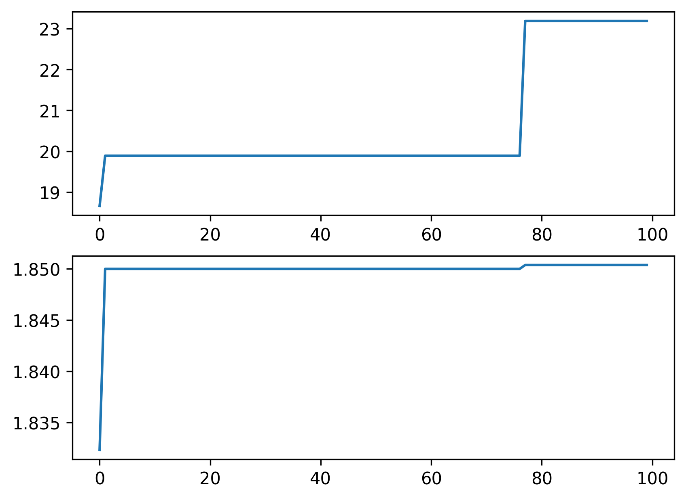
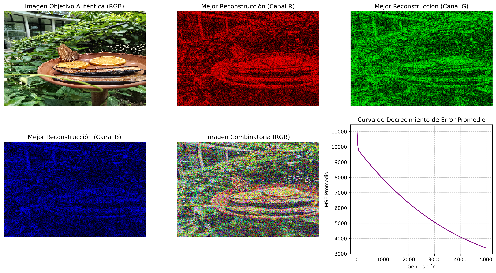

# T3_algoritmos_geneticos


**Desarrolle tres ejercicios de los 6 propuestos, utilice todas las librerías y herramientas disponibles.**

## Maximizar la función 𝑓(𝑥)=𝑥 𝑠𝑒𝑛(10𝜋x) + 1, con 𝑥 ∈[0,1].
**La solución del problema se da en el documento:**
```markdown
[P1_maximo.py](codigo/P1_maximo.py)
```
### Descripción de la Solución
Para la solución de este problema se diseñó un programa orientado a objetos, compuesto por dos clases principales: una clase **Gen** y una clase **Población**.
La clase **Gen** incluye atributos como el tamaño en dos dimensiones, el tipo de representación (entero, decimal o binario), su valor de aptitud, el fenotipo y la probabilidad de cruce. Además, contiene los métodos necesarios para realizar los procesos de mutación y combinación genética.
Por su parte, la clase **Población** gestiona el conjunto de individuos, permitiendo evaluar la aptitud global del grupo, ejecutar los procesos de selección y cruce, e incorporar un mecanismo de elitismo que garantiza la conservación de un número determinado de los mejores individuos en cada generación.
**Función de aptitud**La función de aptitud utilizada corresponde directamente a la función objetivo que se desea optimizar, de modo que su valor máximo representa también la aptitud máxima posible del sistema.
**Tamaño de la población:** Se generó una población inicial de 10 individuos con representación binaria, cada uno con 20 cromosomas. Esta configuración permite una gran cantidad de combinaciones posibles. El proceso evolutivo se ejecutó durante 50 generaciones.
**Elitismo:** El mecanismo de elitismo consiste en seleccionar los 2 individuos con mayor aptitud en cada generación, los cuales pasan directamente a la siguiente etapa de selección, garantizando la preservación de las mejores soluciones encontradas.
**Cruce y mutación** Posteriormente, la población es sometida a procesos de cruce y mutación. Se plantearon dos enfoques para la selección de la nueva población:
1. Combinar las poblaciones antigua y nueva, calcular la aptitud global y seleccionar los individuos con mejor desempeño.
2. Conservar la población que contenga al individuo con mayor aptitud absoluta.
En las iteraciones realizadas, el segundo enfoque demostró ser más efectivo, ya que evita la degradación genética y mantiene la convergencia hacia soluciones óptimas.
**Condición de parada:** La única condición de parada establecida fue el número de generaciones definido al inicio del proceso. Al finalizar, se presenta el mejor individuo encontrado junto con un gráfico que muestra la evolución de su aptitud a lo largo de las generaciones.
Con esto, se presenta una grafica del mejor individuo con el correr de la simulación:


## Verdadera democracia. Suponga que usted es el jefe de gobierno y está interesado en que pasen los proyectos de su programa político. Sin embargo, en el congreso conformado por 5 partidos, no es fácil su tránsito, por lo que debe repartir el poder, conformado por ministerios y otras agencias del gobierno, con base en la representación de cada partido. Cada entidad estatal tiene un peso de poder, que es el que se debe distribuir. Suponga que hay 50 curules, distribuya aleatoriamente, con una distribución no informe entre los 5 partidos esas curules. Defina una lista de 50 entidades y asígneles aleatoriamente un peso político de 1 a 100 puntos. Cree una matriz de poder para repartir ese poder, usando AGs.

## Una empresa proveedora de energía eléctrica dispone de cuatro plantas de generación para satisfacer la demanda diaria de energía eléctrica en Cali, Bogotá, Medellín y Barranquilla. Cada una puede generar 3, 6, 5 y 4 GW al día respectivamente. Las necesidades de Cali, Bogotá, Medellín y Barranquilla son de 4, 3, 5 y 3 GW al día respectivamente. Los costos por el transporte de energía por cada GW entre plantas y ciudades se dan en la siguiente tabla:
```markdown
| | Cali | Bogotá | Medellín | Barranquilla |
| :--- | :---: | :---: | :---: | :---: |
| **Planta C** | 1 | 4 | 3 | 6 |
| **Planta B** | 4 | 1 | 4 | 5 |
| **Planta M** | 3 | 4 | 1 | 4 |
| **Planta Ba** | 6 | 5 | 4 | 1 |

Los costos del KW-H por generador se dan en la siguiente tabla:

| Generador | $KW-H |
| :--- | :---: |
| Planta C | 680 |
| Planta B | 720 |
| Planta M | 660 |
| Planta Ba | 750 |

Encontrar usando AGs el mejor despacho de energía minimizando los costos de transporte y generación.
```

## Genere aleatoriamente una población de 50 matrices de 120 por 180, con números de 0 a 255, preséntelas como una gráfica RGB. La función de aptitud es una imagen cualquiera. Evolucione la población inicial hasta llegar a la imagen.
Para este ejercicio se utilizaron las mismas clases definidas en el primer problema. En este caso, el objetivo consiste en aproximar una imagen mediante un algoritmo genético, por lo que cada individuo representa una posible solución en forma de matrices de píxeles.
Para facilitar la convergencia, la imagen se separó en sus tres canales de color (RGB), generando tres matrices aleatorias iniciales con valores enteros entre 0 y 255. Esta estrategia permite que el algoritmo encuentre soluciones de manera más eficiente, ya que reduce la complejidad del espacio de búsqueda al trabajar cada canal de forma independiente.

La función de aptitud se definió como la diferencia absoluta entre las matrices generadas por el individuo y las matrices de la imagen objetivo, de modo que una menor diferencia implica una mejor aproximación y, por tanto, mayor aptitud.

Adicionalmente, con el fin de aumentar la diversidad genética de la población —considerando que los valores posibles de cada píxel están limitados al rango original (0 a 255)— se implementó una tasa de mutación más alta que en el ejercicio numero uno. Esto permite explorar nuevas combinaciones de valores y evita que el algoritmo quede atrapado en óptimos locales.

Para mejorar el rendimiento computacional, las iteraciones del algoritmo se ejecutaron de forma paralela, reduciendo el tiempo total de simulación. Finalmente, el proceso evolutivo se llevó a cabo durante 5000 generaciones, con el objetivo de encontrar la mejor aproximación posible a la imagen original.
El resultado de este ejercicio es el siguiente:


## Genere aleatoriamente una población de 50 palabras, que se escuche por el parlante del computador. Tomando como función de aptitud una palabra suya, usando AGs, con base en las palabras generadas aleatoriamente llegue a la palabra que usó como función de aptitud.

## Tome el algoritmo de la dieta y ahora incluya costos. Ahora encuentre una dieta que trate de satisfacer la dieta pero con un costo mínimo. Este es un ejemplo de AG multi-objetivo con dos funciones objetivo.
